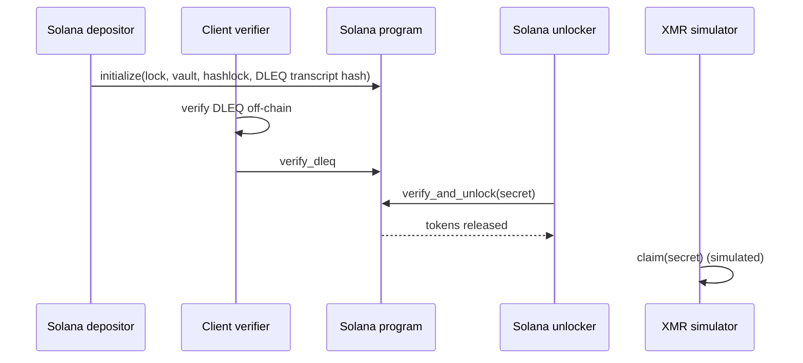

# Architecture

This project implements a Solana <-> Monero atomic swap using an on-chain lock
contract on Solana and off-chain DLEQ verification. The Monero side is currently
simulated to demonstrate the end-to-end flow without running a full Monero node.

## Hackathon Scope

- Demo uses the **XMR simulator** instead of a live Monero RPC.
- DLEQ proofs are verified **client-side** before calling `verify_dleq`.
- Swap coordinator CLI drives the on-chain flow for judges.
- Production roadmap is tracked in `docs/PRODUCTION.md`.

## Components

- **On-chain program (`programs/atomic_lock`)**
  - Manages the lock account and vault PDA.
  - Enforces hashlock and timeouts on-chain.
  - Stores a DLEQ transcript hash; full proof verification is off-chain.

- **Off-chain DLEQ tooling**
  - `tools/dleq_verifier` (Rust verifier + tests).
  - `tools/swap_sdk` (client guardrails + signed audit logs).
  - Frontend `dleq` module for browser-side verification.

- **Operational tooling**
  - `tools/swap_ops` (status API + signed webhook alerts).
  - `tools/swap_coordinator` (orchestrates on-chain demo flow).

- **Monero integration**
  - `tools/xmr_simulator` (demo-only mock wallet + claim flow).
  - `tools/xmr_wallet` (production path using `monero-rpc` + adaptor signatures).

- **Frontend UI**
  - `frontend/` (swap builder, DLEQ/audit/alert verification, execution flow).

## Protocol Flow (Simplified)

## Security Model

- **DLEQ is verified off-chain.** On-chain checks only the transcript hash to
  keep compute costs low. Clients must verify the full proof before calling
  `verify_dleq`.
- **Hashlock enforcement is on-chain.** The secret released during
  `verify_and_unlock` enables the Monero-side claim (simulated).
- **Auditability** is provided via signed logs and signed webhook alerts from
  `swap_sdk` and `swap_ops`.
